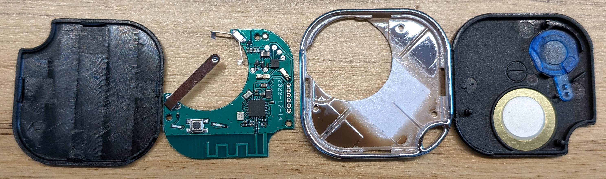

# Shelly BLU Button1 Teardown

https://www.shelly.cloud/de/products/shop/shelly-blu-button1

CPU: EFR32BG22C222 SoC  
Marking:  
BG22  
C222WG  
C01UR4  
2239

Header on the right, from top to bottom:  
VDD  
GND  
PA02 (GPIO.SWDIO)  
PA01 (GPIO.SWCLK)  
PA00  
RESETn  

Button      : PA05  
LED1 (left) : PC03  
LED2 (right): PC04  

